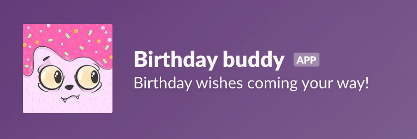

+++
title = "Slack app: Birthday Buddy"
slug = "slack-app-birthday-buddy"
type = "project"
project_type = ["repo", "app"]
date = 2025-08-05T15:34:05Z
draft = false
description = "A little Slack App that sends birthday wishes, built with Python and hosted on Railway"
link = "https://github.com/monsteronfire/birthday-buddy"
tags = ["python", "railway", "cron", "community"]
cover = "project-cover-birthday-buddy.jpg"
+++

## Overview
Birthday Buddy is a little Slack App (or bot), similar to the popular Birthday Bot, but smaller.

## Challenge/Problem
Acknowledging a person's birthday is a low-friction way of tending to social connections. Most people like hearing from their social circle, and a birthday is a reoccurring reason to connect.

## Business Considerations/Context
The self-hosted birthday bot reduces the need for a subscription and also ensures team data is not being stored and processed on third-party servers.

## Approach and technical details
The original plan was to put together a serverless function that ran once a day to check for birthdays and then have it post on Slack via a Slack app if a birthday was found.

I wanted to use Python to build the app, but from the light research I had done, it seemed like only the big cloud providers had support for Python cloud functions. I felt like GCP was a little overkill for this little app, so I eventually landed on Railway with a cron deployment.

`Docker` and `docker-compose` are used only in development to make it easier to work with Postgres. In production, I opted to just let `Railpack` handle the image creation for me.

A birthday message is generated from a random `message_template` and a combination of 3 random emojis. The `slack_sdk` provided the functions needed to tag the birthday person with their Slack username.

## Outcomes
Birthday buddy is currently installed in a Slack group I have with some friends from an old job, and the source code is available on Github. So far, it has run pretty reliably. There are still many opportunities for improvement, but for now, it's good enough.

## Reflections
Building this tool was a fulfilling experience for me. I've been thinking a lot about community maintenance, lately, and I think that there is room for automating certain aspects of relationship maintenance. The real challenge is balancing the automation with some humanness.

## Future Considerations
I have a medium-sized feature list I'd like to get to, eventually. Some considerations include:
- Admin slash functions to manage birthdays, message templates, and emoji selection
- Giphy integration
- One-click Railway deployment

## Github repo


