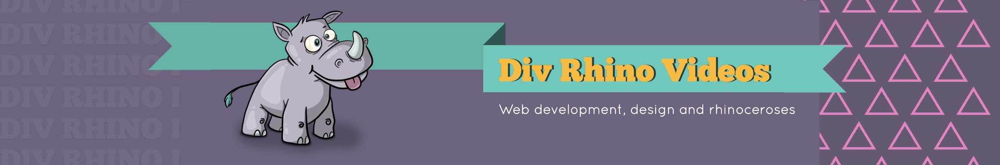

+++
title = "DivRhino YouTube Channel"
slug = "divhino"
type = "project"
project_type = ["site", "youtube", "content creation"]
date = '2025-08-20T13:03:52Z'
date_planted = '2025-08-20T13:02:52Z'
date_tended = '2026-02-03T13:02:52Z'
draft = false
description = "A YouTube channel and website dedicated to project-based learning."
link = "https://www.youtube.com/@DivRhino"
tags = ["YouTube", "Content Creation", "Tutorials", "Golang", "JavaScript", "Git"]
cover = "project-cover-divrhino.jpg"
+++

## Overview
DivRhino is a [YouTube channel](https://www.youtube.com/@DivRhino) and companion [website](https://divrhino.com) dedicated to project-based learning. I'm passionate about teaching and mentorship and I'm on a life-long journey to becoming a better teacher. This project is a creative outlet that allows me to practise teaching, draw cute characters, and learn video editing techniques.

## Challenge/Problem
One of the biggest challenges for this YouTube channel is the way that the YouTube system seems to pigeonhole it in as a Golang-specific channel. I've attempted to branch out into different topics in the past, creating videos about [Git Interactive Rebase](https://www.youtube.com/watch?v=9QsFj4_1UAw) and [JavaScript passkey authentication](https://www.youtube.com/watch?v=1R68BRM5dyA), but neither of these videos were well-received. I really shouldn't focus on viewership metrics, I know, but it's challenging to balance my own interests with those of the audience. So I guess this is an unsolved problem.

## Approach
I started this project because I saw a gap when it came to free content for developers who had outgrown the beginner-phase. My goal was to create intermediate content that focused on workflows and processes that developers used in the real world. I tried to incorporate tools like `Docker` and `git` into the material, as well as emphasising code organisation techniques.

I experimented with my own workflows as well when it came to video and audio editing, script preparation, and planning of closed captions.

## Technical Details
For video editing, I started with iMovie and then moved on to [DaVinci Resolve](https://www.blackmagicdesign.com/products/davinciresolve). For audio editing and cleaning, I used [Audacity](https://www.audacityteam.org). For thumbnails and channel art, I used [Procreate](https://procreate.com/procreate). For planning and project management, I used a combination of [Linear](https://linear.app) and [Notion](https://www.notion.com/desktop).

## Reflections
The teaching practice I got from creating videos has definitely transferred into my day job. The planning and prototyping process has helped me create better internal documentation too. The one thing I need to further reflect on would be my content strategy as a whole. I don't really care enough about optimising metrics, yet they still effect my motivation. It can become unhealthy. However, the whole journey has been a net positive.

## Future Considerations
In future, I may create a brand new channel that focuses on tools and workflows rather than projects. I'd like to get better at Vim and Linux, for example, so a channel may be a fun way to drive that personal learning.
