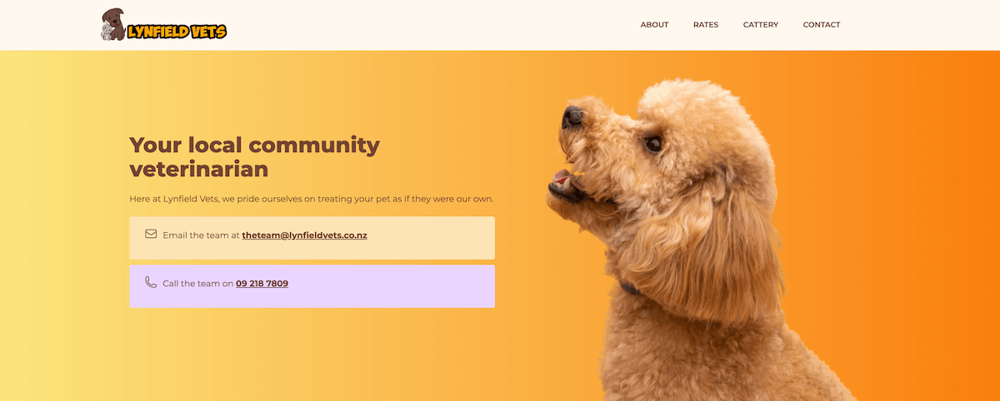

+++
title = "Lynfield Vets"
slug = "lynfield-vets"
type = "project"
project_type = "repo | site | youtube"
date = '2025-08-20T13:03:52Z'
date_planted = '2025-08-20T13:03:52Z'
date_tended = '2025-08-20T13:03:52Z'
draft = false
description = "The business website of Lynfield Vets in Auckland, New Zealand."
link = "https://www.lynfieldvets.co.nz"
tags = ["Web development", "TinaCMS", "NextJS", "CMS", "NextJS", "Webflow", "Low Code"]
cover = "project-cover-lynfield-vets.jpg"
+++

## Overview
Lynfield Vets is a long-term client with whom I have an informal maintenance arrangement. This website serves their main clinic in Auckland.

## Challenge/Problem
One of the key goals when taking on this project was to ensure the solution was as self-service as possible once it went live. The client had previously engaged a developer from Fiverr to design their logo and build their first site on WordPress. That site was great, but there was no agreement in place for long-term support. A year or so later, the site got hacked due to outdated plugins and missing security updates. So when the client wanted a new site, they didn't want it built on WordPress.

These constraints made the project both challenging and interesting.

## Technical details
This project has gone through various iterations. The current version is built with [Webflow](https://webflow.com), with forms powered by [Feathery](https://www.feathery.io/templates). Stock images were sourced via a [Freepik](https://www.freepik.com) subscription.

## Evolution
When I first took on the project around 2019-2020, I was deep in git-based CMS rabbit hole. TinaCMS was gaining traction and, although it hadn’t reached version one ye, I was keen to give it a go as is seemed perfect for this project. This was an exciting period, with TinaCMS undergoing rapid structural changes. I chose to build the client's site with NextJS with TinaCMS.

When TinaCloud came out, I migrated to it, and later switched to the self-hosted version due to changes in pricing. At that point, the project was successfully handed over to the client.

In 2025, the project came back to me because Vercel had dropped support for Node 16, prompting a need for some upgrades. One thing led to another and the site ended up being rebuilt on Webflow.

## Present day status
The site is stable and easy for the client to manage. The move to Webflow has significantly reduced the maintenance load, and support requests are minimal. The client was pleased with the results and commissioned a second website for their sister clinic [[mog-and-dog|Mog and Dog Desexing Clinic]].

## Reflections
This project has taught me a lot about the realities of website maintenance for small business owners. The biggest lesson I learnt from this experience is that it can often be cheaper to just go with a low-code, managed solution from the jump.
