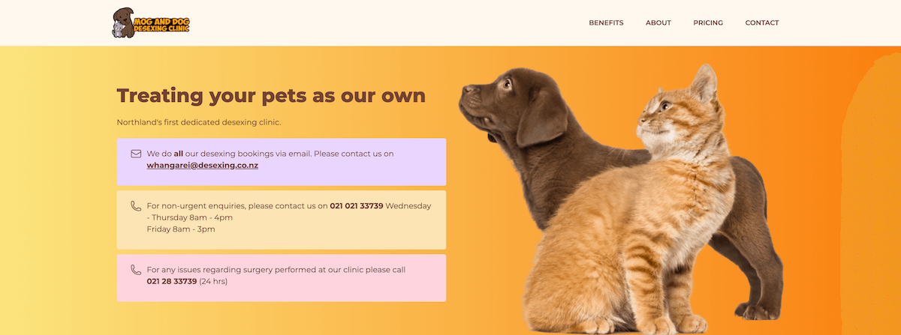

+++
title = "Mog and Dog Desexing Clinic"
slug = "mog-and-dog"
type = "project"
project_type = ["site"]
date = 2023-02-15T10:00:00-07:00
draft = false
description = "The business website of Mog and Dog desexing clinic in Northland, New Zealand."
link = "https://www.desexing.co.nz"
tags = ["Web development", "TinaCMS", "NextJS", "CMS", "NextJS", "Webflow", "Low Code"]
cover = "project-cover-mog-and-dog.jpg"
+++

## Overview
Mog and Dog Desexing Clinic is another website developed for the Lynfield Vets client, expanding their online presence to serve a specialised clinic in Northland, New Zealand.

## Challenge/Problem
The primary challenge for this project was design-focused rather than technical. While the site needed to maintain a coherent brand identity consistent with Lynfield Vets, it also had to stand out as a distinct clinic with its own personality and audience.

## Technical Details
The technical architecture for this project closely mirrored that of the main [[lynfield-vets | Lynfield Vets website]]. Having both sites housed in one Webflow account made it convenient for the client to make updates in an environment they were already familiar with.

## Reflections
Every now and then it is fun to switch contexts and solve non-technical problems. While design isn’t my primary focus, I appreciate the creative problem-solving it requires. This project gave me the opportunity to further develop my design skills.
