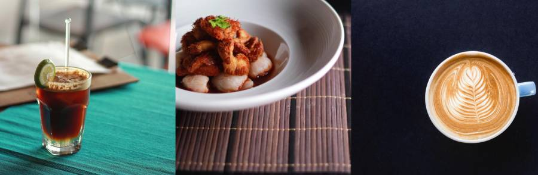

+++
title = 'Standing Theory Cafe'
slug = "standing-theory-cafe"
type = "project"
project_type = ["content creation"]
date = '2026-02-02T16:25:10Z'
date_planted = '2026-02-02T16:25:10Z'
date_tended = '2026-02-02T16:25:10Z'
draft = false
description = "Photography, visual identity design, and content creation for an independent cafe."
link = "https://www.instagram.com/standingtheorycafe/"
tags = ["social media", "instagram", "content creation", "photography"]
domain = ["client"]
cover = "project-cover-standing-theory.jpg"
+++

## Overview
Standing Theory was an independent cafe in Kuala Lumpur and my first foray into freelance content creation. This project marked the beginning of my journey in food photography and social media content strategy.

## The Brief
The cafe needed a cohesive visual identity for their social media presence. My primary task was to create an engaging library of photos featuring their coffee, food, and the cafe atmosphere that could drive customer engagement across Instagram and Facebook.

## My Role
As the initial content creator and photographer, I built a foundational asset library that the cafe could draw from for their social media calendar and promotional materials. While I'm an amateur photographer, my work provided steady images for their Instagram and Facebook channels. The cafe later brought in professional photographers to beef up their collection of photos.

## The Approach
I took a hands-on approach to the photography, bringing my own props and conceptualising shots that would tell the cafe's story. My subjects ranged from the coffee and menu items to spontaneous moments with customers and the neighbourhood's visiting stray dog, who became an unexpected star of the feed.

I scheduled regular shoot days at the cafe to photograph new menu additions and document improvements to the physical space. This ensured the social media manager always had fresh, relevant content that reflected the current state of the business.

## The Impact
While the cafe is no longer in operation, during its run the social media team had a robust catalogue of photo assets at their disposal.

## Reflections
This project was transformative for me personally. It was my first experience creating content for a client and working within the constraints of a brand identity. Through this work, I discovered a passion for food photography and developed an interest in community management and social media engagement strategies.


